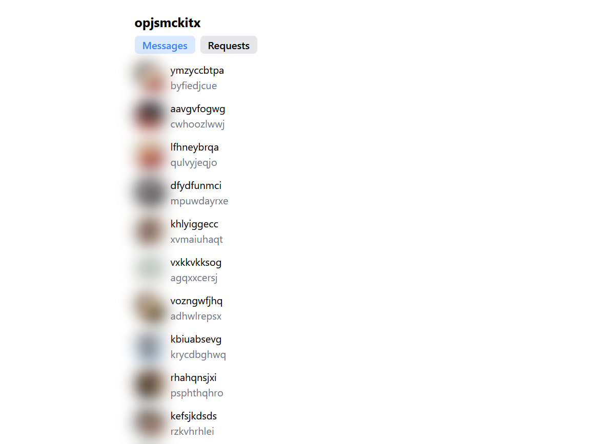
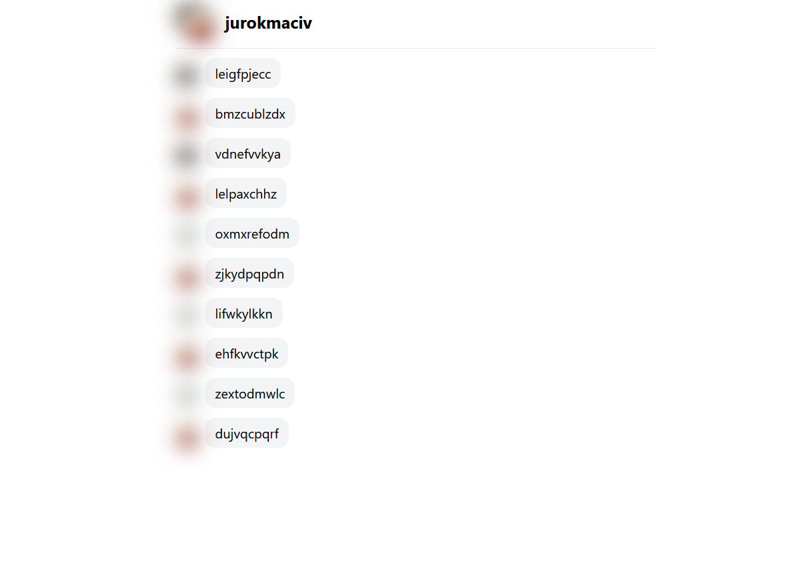

Currently a WIP - sending messages does not work.

## Usage

```bash
# Install necessary dependencies
pnpm run install

# Then create a .env file in the server directory
# .env.example is provided as an example format
# Your Instagram username & password is required

# Run vite frontend & backend in parallel
# Access from vite url (most likely http://localhost:5173/)
pnpm run dev
```

## Preview




```js
// script to anonymize screenshots
document.querySelectorAll("img,h1,p").forEach((el) => {
  if ("textContent" in el && el.textContent.length > 0) {
    el.textContent = new Array(Math.floor(Math.random(20) + 10))
      .fill(0)
      .map((_, i) =>
        String.fromCharCode(Math.floor(Math.random() * 26) + "a".charCodeAt(0))
      )
      .join("");
  }

  if (el.tagName.toLowerCase() === "img") {
    el.classList.add("blur-md");
    el.classList.add("bg-black");
  }
});
```
